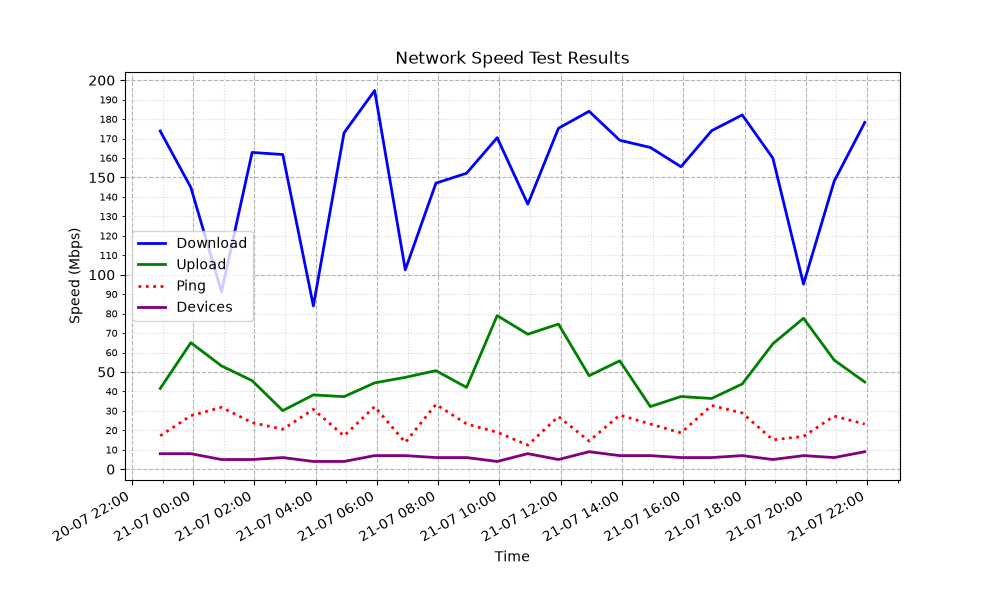

<p align="center">
  
</p>

<h1 align="center">netmon</h1>

<p align="center">
  <b>Self-hosted local network monitor with 24-hour speed charts & sarcastic AI commentary delivered straight to Telegram.</b>
</p>

<p align="center">
  <a href="LICENSE"></a>
  
  
  
  
</p>

---

A lightweight local bot that runs a speed test on your network every hour, scans active devices on your LAN using `nmap`, and logs everything to a local SQLite database. 

Every 4 hours, it delivers a **detailed report** complete with a 24-hour trend graph and a sarcastic, LLM-generated commentary on your network's behavior (*"someone's hogging the bandwidth again"*).

> [!NOTE]
> **100% Private & Self-Hosted:** No external metric servers involved — everything runs locally on your machine or Raspberry Pi. Only text reports and graph images are dispatched to your Telegram chat.

---

## Features & Workflow

Every hour (`SLEEP_TIME` in `main.py`, default 3600 seconds):

1. **Speed Test:** Measures download/upload speeds, ping latency, ISP, and test server details using `speedtest-cli`.
2. **LAN Scan:** Scans the local subnet using `nmap` ARP scan to count active connected devices.
3. **Local Storage:** Saves metrics & device tallies directly to a local `metrics.sql` SQLite database.
4. **Status Alert:** Sends a concise status update to Telegram (*"all good"* or *"line is dying"*).
5. **24h AI Report:** Every 4th cycle (every 4h), generates a **24-hour trend graph** via `matplotlib` alongside a sarcastic LLM analysis of network load and speed fluctuations.

---

## Tech Stack

| Technology | Purpose |
| :--- | :--- |
| **Python 3.11+** | Core runtime |
| **SQLite** | Local metrics persistence (`metrics.sql`) |
| **`speedtest-cli`** | Network bandwidth and ping measurements |
| **`nmap`** | Subnet ARP scanning for device discovery |
| **`matplotlib`** | 24-hour metrics visualization |
| **OpenAI API** | Sarcastic report & trend analysis generation |
| **Telegram API** | Alert and graph report delivery |

---

## Requirements

* **OS:** macOS or Linux (`nmap --iflist` required; Windows not supported out of the box).
* **Python:** 3.11+
* **System Binaries:** `nmap` and `speedtest-cli` installed system-wide.
* **Tokens:** Telegram Bot Token, Telegram Chat ID, and OpenAI-compatible API key.

---

## Quick Start

### 1. System Dependencies

**macOS (Homebrew):**
```bash
brew install nmap speedtest-cli
```

**Linux (Debian/Ubuntu):**
```bash
sudo apt update && sudo apt install -y nmap speedtest-cli
```

### 2. Clone & Setup Environment

```bash
git clone https://github.com/Role1776/netmon.git
cd netmon
python3 -m venv .venv
source .venv/bin/activate
pip install -r requirements.txt
```

### 3. Configure `.env`

Copy the template file and fill in your secrets:

```bash
cp .env.example .env
```

`.env` variables:

| Variable | Description |
| :--- | :--- |
| `AI_API_KEY` | Your LLM provider API key |
| `AI_MODEL` | Model name (e.g. `gpt-4o-mini`) |
| `AI_BASE_URL` | Base API URL (e.g., `https://api.openai.com/v1`) |
| `TG_BOT_TOKEN` | Telegram bot token from `@BotFather` |
| `TG_CHAT_ID` | Your Telegram Chat ID |
| `DB_PATH` | SQLite database file path (e.g. `metrics.sql`) |

### 4. Run the Bot

```bash
python3 main.py
```

> [!TIP]
> Run the bot inside `tmux`/`screen` or set it up as a system service (`systemd`/`launchd`) to keep it running 24/7 in the background.

---

## Example Output

### Hourly Short Status Update

```text
Network Status Update
Time: 2026-07-21 14:00:00
ISP: MyISP | Server: New York

Devices online: 7
Download: 145.2 Mbps
Upload: 62.1 Mbps
Latency: 14.8 ms

Traffic used: 160.0 MB down / 70.0 MB up

Current status: Good speed and low latency
```

### 4-Hour Detailed Report (With Graph & AI Analysis)

Every 4 hours, the bot sends a **24-hour matplotlib graph** accompanied by a sarcastic LLM-generated report:

<p align="center">
  
</p>

```html
<b>Network Speed Test Report (24h Analysis)</b>

Client: <b>MyISP</b>
Server: <b>New York</b>

<b>Latest Test Metrics</b>
<pre>
Download: 178.5 Mbps
Upload: 45.2 Mbps
Ping: 23.1 ms
Devices Online: 9
</pre>

<b>24-Hour Dynamics Analysis</b>
Over the last 24 hours, the download speed averaged <code>140 Mbps</code>, but we saw a massive drop to <code>20 Mbps</code> at 8:00 PM right as device count jumped from <code>4</code> to <code>11 devices</code>. Clearly, someone's hogging the bandwidth or the ISP's mice were busy chewing on the fiber line again. Latency remained stable except for a brief spike during peak hours.

<b>Data Transfer (Latest Test)</b>
<pre>
Downloaded: 160.0 MB
Uploaded: 70.0 MB
</pre>

<b>Conclusion</b>
Expect periodic speed drops whenever local freeloaders stream 4K movies or the ISP potato infrastructure struggles.
```

---

## Project Structure

```text
netmon/
├── assets/         # Logo & documentation media assets
├── graphs/         # Generated 24h matplotlib graph images
├── main.py         # Main execution loop & orchestrator
├── runner.py       # Speedtest-cli and nmap scan execution & parsing
├── sqlite.py       # SQLite database operations & schema management
├── models.py       # Domain data models (NetworkMetric, SpeedTest)
├── graphs.py       # Matplotlib graph rendering engine
├── ai.py           # OpenAI API client & sarcastic text generator
├── tg.py           # Telegram bot dispatch helper
├── config.py       # Environment variable validation & config
└── LICENSE         # MIT License file
```

---

## License

Distributed under the **MIT License**. See [`LICENSE`](LICENSE) for more details.
